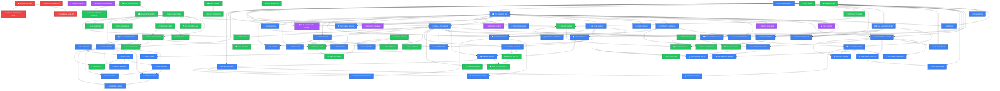

# 🌌 HYPER-SILLs Skill Constellation

> Nodes colored by category: 🔵 agents · 🟢 dev · 🟣 broski · 🔴 youtube. Edges = `depends_on`. ⚡N = times used (from .skill-memory).

```mermaid
graph TD
    HS_127["📊 SIGNAL HUNTER"]
    HS_132["🥊 THUMBNAIL DUELIST"]
    HS_133["✂️ SHORTS ALCHEMIST"]
    HS_134["🔁 SIGNAL-TO-SCRIPT LOOP"]
    HS_123["⚡ GODFLOW"]
    HS_126["🔗 NODE SMITH"]
    HS_007["🐝 SWARM CROWN"]
    HS_125["🏆 THE GRAND CODEX"]
    HS_010["🎨 THE AESTHETE"]
    HS_011["🧩 MIND BLOCKS"]
    HS_012["🪜 THE ASCENT"]
    HS_013["🌅 DAWN HERALD"]
    HS_014["🔮 VAULT KEEPER"]
    HS_015["🗂️ THE FOUR DRAWERS"]
    HS_016["📖 BRAIN PRIMER"]
    HS_017["🧠 MIND CORE"]
    HS_018["🌉 BRIDGE KEEPER"]
    HS_124["🦅 FOCUS HAWK"]
    HS_020["🌄 HERALD'S SCROLL"]
    HS_021["🔄 VAULT SYNC"]
    HS_022["📦 SDK SOVEREIGN"]
    HS_023["🔗 REPO BRIDGE"]
    HS_024["🚀 PUBLISH RITE"]
    HS_025["🪙 COIN MENDER"]
    HS_026["🎓 GRADUATION GATE"]
    HS_027["📋 TEST HERALD"]
    HS_028["📖 SDK PRIMER"]
    HS_029["📮 PUBLISH FORGE"]
    HS_067["👑 THE THRONE LADDER"]
    HS_008["🎭 THE CONDUCTOR"]
    HS_069["💚 MERCY MESSAGE"]
    HS_019["👁️ THE ALL-SEEING"]
    HS_071["🪂 SOFT LANDING"]
    HS_072["🗃️ THE MEMORY VAULT"]
    HS_073["📡 PULSE STREAM"]
    HS_074["🚀 THE API CODEX"]
    HS_075["🎯 THE CHOICE MATRIX"]
    HS_076["✅ THE GATEKEEPER"]
    HS_077["🛑 CONSENT GUARDIAN"]
    HS_078["🌊 FLOW KEEPER"]
    HS_079["👥 THE CREW CHARTER"]
    HS_080["🧰 THE TOOL BELT"]
    HS_081["🔌 PORTAL FORGE"]
    HS_082["🏷️ THE NAMING LAW"]
    HS_083["🗣️ THE THREE VOICES"]
    HS_084["📐 THE STYLE CODEX"]
    HS_085["🚧 THE FIVE WARDS"]
    HS_086["🔺 THE FOUR TIERS"]
    HS_087["🌳 THE BRANCHING PATH"]
    HS_088["🪞 THE MIRROR OATH"]
    HS_089["🗺️ THE GRAND ROSTER"]
    HS_090["📜 SOUL SCROLL"]
    HS_091["🪪 THE FOUNDING SIX"]
    HS_092["🧪 CONTRACT FORGE"]
    HS_093["🌙 NIGHT TENDER"]
    HS_094["🚀 THE SIX-SPRINT MARCH"]
    HS_095["📒 THE LEDGER LAW"]
    HS_096["🗓️ THE LONG MARCH"]
    HS_097["🕸️ THE WEB OF NEEDS"]
    HS_098["🏛️ THE SACRED SIX"]
    HS_099["🧬 SIX-ORGAN HEART"]
    HS_100["🔄 CRADLE-TO-GRAVE"]
    HS_101["😴 DREAM GUARD"]
    HS_102["📈 SLOPE ORACLE"]
    HS_103["🤝 HEALER'S CHORUS"]
    HS_104["🛡️ THE THREE WALLS"]
    HS_105["📊 THE METRICS OATH"]
    HS_106["🌱 THE BIRTH RITE"]
    HS_107["🏆 THE RANK & THE NAME"]
    HS_108["🔱 REALITY ANCHOR"]
    HS_109["🐕 GREP HOUND"]
    HS_110["⚔️ TRIM LORD"]
    HS_111["🚩 TRUTH FLAGGER"]
    HS_112["🕸️ WEB WEAVER"]
    HS_113["⚒️ FETCH FORGE"]
    HS_128["🏗️ PLUGIN FORGE"]
    HS_129["🌐 SKILLS-OVER-MCP"]
    HS_130["🚢 OCI SKILL SHIP"]
    HS_131["🪆 THE NESTED SWARM"]
    HS_034["🎯 BEAT ARCHITECT"]
    HS_036["🧠 ANALOGY ARSENAL"]
    HS_038["🛡️ PHASE WARDEN"]
    HS_040["🥅 GOALKEEPER"]
    HS_041["⚡ METRICS FORGE"]
    HS_042["📋 REGISTRY LORD"]
    HS_043["🔄 LOOP MASTER"]
    HS_044["🧪 AB SPLITTER"]
    HS_045["💰 FRUGAL ENGINE"]
    HS_050["🛡️ WATCHDOG PRIME"]
    HS_114["🛠️ BRAIN OPS"]
    HS_120["🧪 AB FORGE"]
    HS_121["🔄 LOOP FORGE"]
    HS_122["🔭 GUARDIAN WATCHDOG"]
    DS_002["⚡ CLI LAUNCHER"]
    DS_009["🛫 PREFLIGHT"]
    DS_028["⏳ HEALTH WAITER"]
    HS_127 --> HS_132
    HS_127 --> HS_134
    HS_098 --> HS_123
    HS_099 --> HS_123
    HS_099 --> HS_126
    HS_099 --> HS_007
    HS_098 --> HS_007
    HS_100 --> HS_007
    HS_016 --> HS_011
    HS_017 --> HS_011
    HS_098 --> HS_012
    HS_011 --> HS_013
    HS_016 --> HS_013
    HS_113 --> HS_014
    HS_125 --> HS_016
    HS_016 --> HS_017
    HS_017 --> HS_018
    HS_016 --> HS_018
    HS_016 --> HS_124
    HS_011 --> HS_124
    HS_013 --> HS_020
    HS_016 --> HS_020
    HS_014 --> HS_021
    HS_016 --> HS_021
    HS_007 --> HS_022
    HS_074 --> HS_022
    HS_113 --> HS_023
    HS_113 --> HS_024
    HS_076 --> HS_024
    DS_009 --> HS_025
    HS_096 --> HS_026
    HS_086 --> HS_027
    HS_125 --> HS_028
    HS_024 --> HS_029
    HS_113 --> HS_029
    HS_099 --> HS_067
    HS_098 --> HS_067
    HS_007 --> HS_008
    HS_089 --> HS_008
    HS_098 --> HS_069
    HS_100 --> HS_019
    HS_103 --> HS_019
    HS_100 --> HS_071
    HS_085 --> HS_071
    HS_099 --> HS_072
    HS_100 --> HS_072
    HS_099 --> HS_073
    HS_083 --> HS_073
    HS_084 --> HS_074
    HS_092 --> HS_074
    HS_098 --> HS_075
    HS_077 --> HS_075
    HS_084 --> HS_076
    HS_086 --> HS_076
    HS_098 --> HS_077
    HS_098 --> HS_078
    HS_067 --> HS_079
    HS_008 --> HS_079
    HS_099 --> HS_080
    HS_067 --> HS_080
    HS_074 --> HS_081
    HS_089 --> HS_081
    HS_084 --> HS_082
    HS_067 --> HS_083
    HS_008 --> HS_083
    HS_098 --> HS_085
    HS_084 --> HS_086
    HS_075 --> HS_087
    HS_067 --> HS_087
    HS_077 --> HS_087
    HS_087 --> HS_088
    HS_085 --> HS_088
    HS_099 --> HS_089
    HS_099 --> HS_091
    HS_089 --> HS_091
    HS_099 --> HS_092
    HS_100 --> HS_093
    HS_043 --> HS_093
    HS_085 --> HS_093
    HS_096 --> HS_094
    HS_084 --> HS_095
    HS_090 --> HS_097
    HS_089 --> HS_097
    HS_099 --> HS_098
    HS_099 --> HS_100
    HS_098 --> HS_100
    DS_028 --> HS_101
    HS_100 --> HS_101
    HS_100 --> HS_103
    HS_071 --> HS_103
    HS_098 --> HS_104
    HS_099 --> HS_104
    HS_019 --> HS_105
    HS_099 --> HS_106
    HS_084 --> HS_106
    HS_076 --> HS_106
    HS_098 --> HS_107
    HS_099 --> HS_107
    HS_109 --> HS_108
    HS_098 --> HS_111
    HS_081 --> HS_128
    HS_081 --> HS_129
    HS_128 --> HS_130
    HS_008 --> HS_131
    HS_085 --> HS_131
    HS_098 --> HS_034
    HS_098 --> HS_036
    HS_098 --> HS_038
    HS_085 --> HS_038
    HS_077 --> HS_038
    HS_043 --> HS_040
    HS_100 --> HS_040
    HS_099 --> HS_041
    HS_019 --> HS_041
    HS_008 --> HS_042
    HS_067 --> HS_042
    HS_100 --> HS_043
    HS_098 --> HS_043
    HS_098 --> HS_044
    HS_043 --> HS_044
    HS_041 --> HS_045
    HS_008 --> HS_045
    HS_038 --> HS_050
    HS_041 --> HS_050
    HS_016 --> HS_114
    HS_017 --> HS_114
    HS_098 --> HS_120
    HS_043 --> HS_120
    HS_043 --> HS_121
    HS_100 --> HS_121
    HS_038 --> HS_122
    HS_041 --> HS_122
    HS_084 --> DS_002
    HS_100 --> DS_009
    HS_084 --> DS_009
    HS_103 --> DS_028
    HS_071 --> DS_028
    style HS_127 fill:#ef4444,color:#fff,stroke:#1e293b
    style HS_132 fill:#ef4444,color:#fff,stroke:#1e293b
    style HS_133 fill:#ef4444,color:#fff,stroke:#1e293b
    style HS_134 fill:#ef4444,color:#fff,stroke:#1e293b
    style HS_123 fill:#3b82f6,color:#fff,stroke:#1e293b
    style HS_126 fill:#3b82f6,color:#fff,stroke:#1e293b
    style HS_007 fill:#3b82f6,color:#fff,stroke:#1e293b
    style HS_125 fill:#3b82f6,color:#fff,stroke:#1e293b
    style HS_010 fill:#a855f7,color:#fff,stroke:#1e293b
    style HS_011 fill:#3b82f6,color:#fff,stroke:#1e293b
    style HS_012 fill:#a855f7,color:#fff,stroke:#1e293b
    style HS_013 fill:#3b82f6,color:#fff,stroke:#1e293b
    style HS_014 fill:#22c55e,color:#fff,stroke:#1e293b
    style HS_015 fill:#a855f7,color:#fff,stroke:#1e293b
    style HS_016 fill:#3b82f6,color:#fff,stroke:#1e293b
    style HS_017 fill:#3b82f6,color:#fff,stroke:#1e293b
    style HS_018 fill:#3b82f6,color:#fff,stroke:#1e293b
    style HS_124 fill:#3b82f6,color:#fff,stroke:#1e293b
    style HS_020 fill:#3b82f6,color:#fff,stroke:#1e293b
    style HS_021 fill:#3b82f6,color:#fff,stroke:#1e293b
    style HS_022 fill:#22c55e,color:#fff,stroke:#1e293b
    style HS_023 fill:#22c55e,color:#fff,stroke:#1e293b
    style HS_024 fill:#22c55e,color:#fff,stroke:#1e293b
    style HS_025 fill:#22c55e,color:#fff,stroke:#1e293b
    style HS_026 fill:#22c55e,color:#fff,stroke:#1e293b
    style HS_027 fill:#22c55e,color:#fff,stroke:#1e293b
    style HS_028 fill:#3b82f6,color:#fff,stroke:#1e293b
    style HS_029 fill:#22c55e,color:#fff,stroke:#1e293b
    style HS_067 fill:#3b82f6,color:#fff,stroke:#1e293b
    style HS_008 fill:#3b82f6,color:#fff,stroke:#1e293b
    style HS_069 fill:#a855f7,color:#fff,stroke:#1e293b
    style HS_019 fill:#3b82f6,color:#fff,stroke:#1e293b
    style HS_071 fill:#3b82f6,color:#fff,stroke:#1e293b
    style HS_072 fill:#3b82f6,color:#fff,stroke:#1e293b
    style HS_073 fill:#3b82f6,color:#fff,stroke:#1e293b
    style HS_074 fill:#22c55e,color:#fff,stroke:#1e293b
    style HS_075 fill:#3b82f6,color:#fff,stroke:#1e293b
    style HS_076 fill:#22c55e,color:#fff,stroke:#1e293b
    style HS_077 fill:#3b82f6,color:#fff,stroke:#1e293b
    style HS_078 fill:#3b82f6,color:#fff,stroke:#1e293b
    style HS_079 fill:#3b82f6,color:#fff,stroke:#1e293b
    style HS_080 fill:#3b82f6,color:#fff,stroke:#1e293b
    style HS_081 fill:#22c55e,color:#fff,stroke:#1e293b
    style HS_082 fill:#22c55e,color:#fff,stroke:#1e293b
    style HS_083 fill:#3b82f6,color:#fff,stroke:#1e293b
    style HS_084 fill:#22c55e,color:#fff,stroke:#1e293b
    style HS_085 fill:#3b82f6,color:#fff,stroke:#1e293b
    style HS_086 fill:#22c55e,color:#fff,stroke:#1e293b
    style HS_087 fill:#3b82f6,color:#fff,stroke:#1e293b
    style HS_088 fill:#3b82f6,color:#fff,stroke:#1e293b
    style HS_089 fill:#3b82f6,color:#fff,stroke:#1e293b
    style HS_090 fill:#3b82f6,color:#fff,stroke:#1e293b
    style HS_091 fill:#3b82f6,color:#fff,stroke:#1e293b
    style HS_092 fill:#22c55e,color:#fff,stroke:#1e293b
    style HS_093 fill:#3b82f6,color:#fff,stroke:#1e293b
    style HS_094 fill:#22c55e,color:#fff,stroke:#1e293b
    style HS_095 fill:#22c55e,color:#fff,stroke:#1e293b
    style HS_096 fill:#22c55e,color:#fff,stroke:#1e293b
    style HS_097 fill:#3b82f6,color:#fff,stroke:#1e293b
    style HS_098 fill:#3b82f6,color:#fff,stroke:#1e293b
    style HS_099 fill:#3b82f6,color:#fff,stroke:#1e293b
    style HS_100 fill:#3b82f6,color:#fff,stroke:#1e293b
    style HS_101 fill:#22c55e,color:#fff,stroke:#1e293b
    style HS_102 fill:#22c55e,color:#fff,stroke:#1e293b
    style HS_103 fill:#3b82f6,color:#fff,stroke:#1e293b
    style HS_104 fill:#3b82f6,color:#fff,stroke:#1e293b
    style HS_105 fill:#22c55e,color:#fff,stroke:#1e293b
    style HS_106 fill:#22c55e,color:#fff,stroke:#1e293b
    style HS_107 fill:#a855f7,color:#fff,stroke:#1e293b
    style HS_108 fill:#22c55e,color:#fff,stroke:#1e293b
    style HS_109 fill:#22c55e,color:#fff,stroke:#1e293b
    style HS_110 fill:#22c55e,color:#fff,stroke:#1e293b
    style HS_111 fill:#3b82f6,color:#fff,stroke:#1e293b
    style HS_112 fill:#22c55e,color:#fff,stroke:#1e293b
    style HS_113 fill:#22c55e,color:#fff,stroke:#1e293b
    style HS_128 fill:#22c55e,color:#fff,stroke:#1e293b
    style HS_129 fill:#22c55e,color:#fff,stroke:#1e293b
    style HS_130 fill:#22c55e,color:#fff,stroke:#1e293b
    style HS_131 fill:#3b82f6,color:#fff,stroke:#1e293b
    style HS_034 fill:#a855f7,color:#fff,stroke:#1e293b
    style HS_036 fill:#a855f7,color:#fff,stroke:#1e293b
    style HS_038 fill:#3b82f6,color:#fff,stroke:#1e293b
    style HS_040 fill:#3b82f6,color:#fff,stroke:#1e293b
    style HS_041 fill:#3b82f6,color:#fff,stroke:#1e293b
    style HS_042 fill:#3b82f6,color:#fff,stroke:#1e293b
    style HS_043 fill:#3b82f6,color:#fff,stroke:#1e293b
    style HS_044 fill:#3b82f6,color:#fff,stroke:#1e293b
    style HS_045 fill:#3b82f6,color:#fff,stroke:#1e293b
    style HS_050 fill:#3b82f6,color:#fff,stroke:#1e293b
    style HS_114 fill:#22c55e,color:#fff,stroke:#1e293b
    style HS_120 fill:#3b82f6,color:#fff,stroke:#1e293b
    style HS_121 fill:#3b82f6,color:#fff,stroke:#1e293b
    style HS_122 fill:#3b82f6,color:#fff,stroke:#1e293b
    style DS_002 fill:#22c55e,color:#fff,stroke:#1e293b
    style DS_009 fill:#22c55e,color:#fff,stroke:#1e293b
    style DS_028 fill:#22c55e,color:#fff,stroke:#1e293b
```
